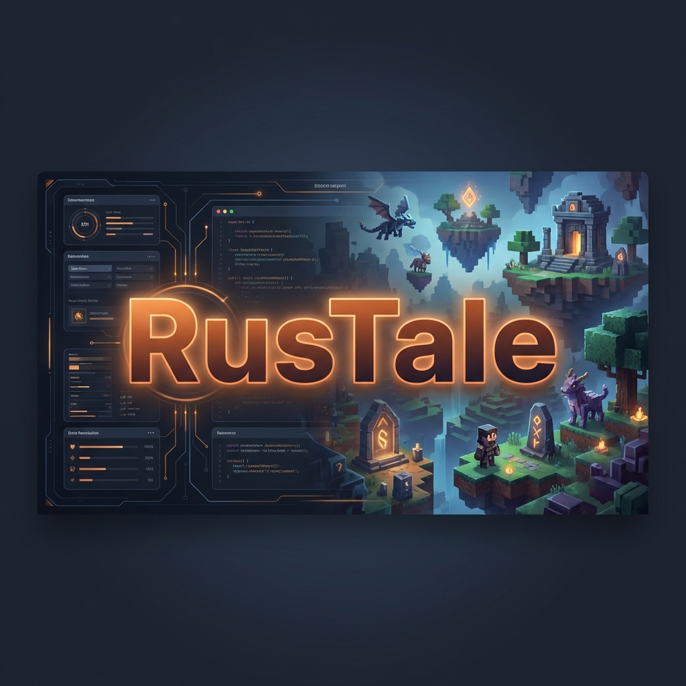

# RusTale

**RusTale** is a custom launcher for Hytale designed to be fast, lightweight, and easy to use. Forget complex configurations; just open, customize, and play.

## ✨ Main Features

### 🎮 Game Experience
*   **Profile Management**: Create and switch between multiple user profiles easily. Ideal for sharing the PC or managing multiple accounts.
*   **Quickplay Mode**: Need to get in fast? Enter the game instantly with your last used profile with a single click.
*   **Custom Server Support**: Play on any server, compatible with official authentication and community private servers.

### 🛠️ Personalization and Mods
*   **Integrated Mod Manager**: Install and organize your mods easily.
*   **Automatic ZIP mod installation**: Apply patches and modifications (even from ZIP files) to the game files.
*   **Local Mode**: Support for offline play or local server development.

### ⚡ Performance and Convenience
*   **Lightweight**: Designed to consume minimal resources while playing.
*   **Always Updated**: The launcher automatically detects and installs updates to keep you on the latest version.
*   **System Tray**: Minimizes the launcher to the system tray to keep your desktop clean while playing.
*   **Responsive Interface**: Adapts perfectly to any window size or resolution.

## ⚠️ Disclaimer & Contact

**This project has been created strictly for educational purposes.**

RusTale is an independent project and is not affiliated, endorsed, or connected with Hypixel Studios or the Hytale team. All game assets and trademarks belong to their respective owners.

For DMCA concerns or takedown requests, please contact me directly at:
**`el@cocaine.ninja`**
